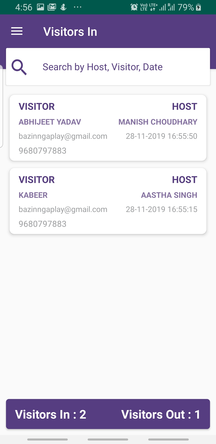
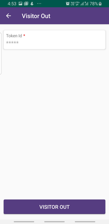
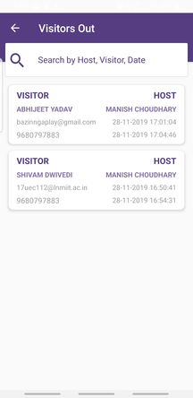

# Innovaccer-SummerGeeks-SDE-Intern
Innovaccer's SummerGeeks 2020 Assignment

## Contents
* **[Overview](#overview)**    
* **[Resources Used](#resources-used)**    
* **[Approach](#approach)**    
* **[Application Flow](#application-flow)**    
* **[Application Installation](#application-installation)**    
* **[Database Structure](#database-structure)**   

## Overview
There are two android applications :
* **Reception** : This application is handled by the receptionist (administrator). It serves four purposes:     
    * Dashboard -> To monitor all the visitors that are currently in the facility.   
    * All Hosts -> To view all hosts that are registered.
    * Visitors Out -> To check the record of all the visitors who already visited the facility.
    * Register New Host -> To add a new host.
* **VisitorManagement** : This application is handled by the visitor at the reception desk. It serves two purpose:
    * Visitor-In -> To check-in the facility.
    * Visitor-Out -> To check-out of the facility.
    
## Resources Used
* Android Studio (Java and XML)
* Backend - Firebase Realtime Database
* Java Mail API (for auto mailing using JAVA)
* Textlocal API (for automated text messaging)

## Approach
* The Reception application is handled by the receptionist (administrator).
* The VisitorManagement application, at the reception desk, is handled by the visitor entering or exiting the facility.
* As there can be multiple hosts, the admin can add new hosts.
* On check-in, each visitor gets a unique token, which is used at the time of check-out.
* As it is a public register meaning each visitor won't have to authenticate itself.

## Application Flow

* **Adding a new Host :** The admin adds a new host by accessing the **Register New Host** option from the Navigation drawer of Dashboard    
  and enters the details. Then you can see the host is added by accessing the **All Host** option from Drawer

Access the Navigation Drawer     |  Fill the required details and  | List of Hosts
:-------------------------------------:|:---------------------------------:|:----------------------------------:
| |**press the Register button** | | 
   |    |  
 
 * **Check-in :** A visitor accesses the VisitorManagement application at the reception desk, clicks the Visitor-In button, enters the required details, selects a host by clicking the the search button and then check-in by pressing the **VISITOR IN** button
 
 
 Click the Visitor In button     |  Fill the required details| Access the list of Hosts by 
 |:-------------------------------------:|:---------------------------------:|:----------------------------------:|
| | | **clicking the search button** |   
 |  |    |  |
 
The list of Hosts    | Press the Visitor In button | 
 |:-------------------------------------:|:---------------------------------:|
 |   |    |
 
 * This should trigger an **email** and an **SMS** to the host informing him of the details of the visitor and also should trigger an **email** to the visitor containing his unique token to be used for check-out.
 
Email to the Host     |  SMS to the Host  | Email to the Visitor
:-------------------------------------:|:---------------------------------:|:----------------------------------:
   |    |  
 
 * **Reception Dashboard :** This will show all the visitors that are currently in the facility.  
     
 
 
 * **Check-Out :** The visitor who wants to exit the facility, clicks the **VISITOR OUT** button and then enters his unique token-id and then clicks the Visitor-Out button.     
     
 
 
 * **Visitors Out :** If the admin wants to check the record of visitors who visited the facility, then he can click the **Visitors Out** button from the navigation drawer.    
      


 ## Application Installation
* Clone the repository and run the two applications seperately in your <b>Android Studio</b> and run it on your android device or an emulator.
* You can also [generate an APK](https://stackoverflow.com/questions/16709848/build-unsigned-apk-file-with-android-studio) from <b>Android Studio</b> and install it on any Android phone you want.
* You can also download APK from **Apks** folder of the project. Alternatively you can navigate to app/build/outputs/debug/app-debug.apk of both the applications and download the app.
    
## Database Structure
```
EntryManagementSoftware 
 |
 |__Visitors-In
    |__HostId
       |__Visitors
           |__GeneratedId(Timestamp)
              |__visitorEmail
              |__visitorName
              |__visitorPhone
              |__visitorToken
       |__hostAddress
       |__hostEmail
       |__hostName
       |__hostPhone
 |__Visitors-Out
    |__HostId
       |__Visitors
           |__GeneratedId(Timestamp)
              |__visitorCheckOutTime
              |__visitorEmail
              |__visitorName
              |__visitorPhone
       |__hostAddress
       |__hostEmail
       |__hostName
       |__hostPhone
 ```

 
